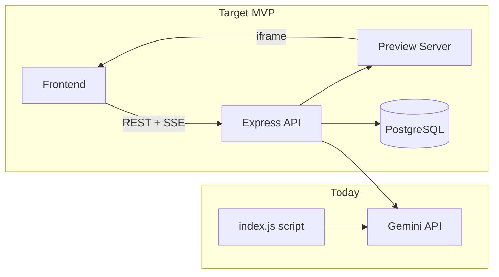
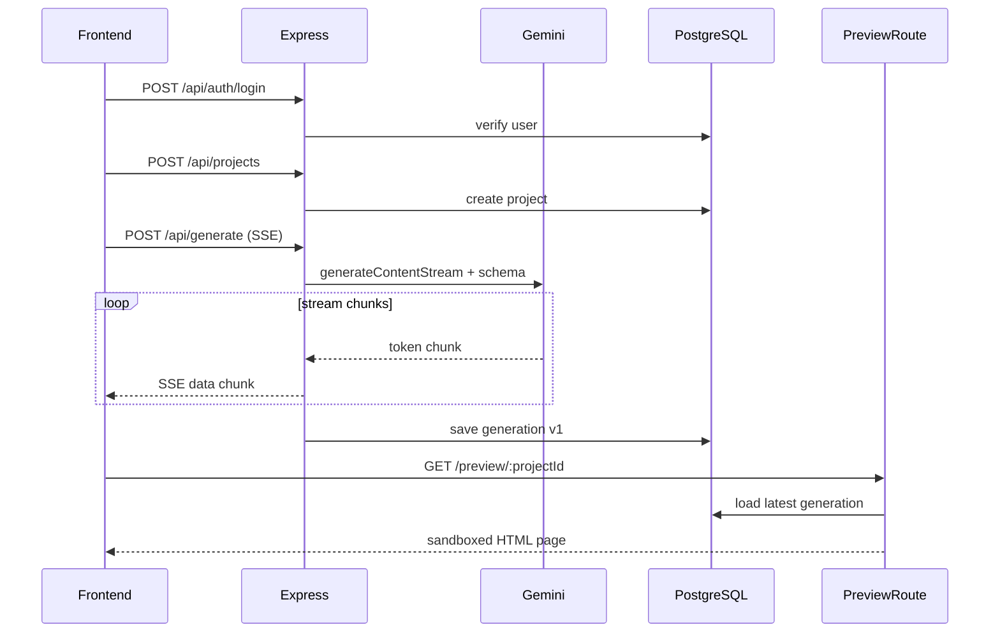

# No-Code AI App Builder — Backend Plan

## Where you are today

[`backend/index.js`](backend/index.js) is a standalone Gemini test script (not an HTTP server). Express is installed but unused; [`backend/server.js`](backend/server.js) is empty. You already have the hardest piece started: **Gemini streaming** via `mainstream()`.



---

## What to add beyond Gemini

### Tier 1 — Must-have for MVP + live preview

| Layer | What to add | Why |
|-------|-------------|-----|
| **HTTP server** | Wire Express in [`server.js`](backend/server.js), mount routes, start from [`index.js`](backend/index.js) | Turns Gemini into a real API the frontend can call |
| **Database** | PostgreSQL + Prisma | Store users, projects, prompts, generated code, version history |
| **Auth** | JWT sessions or Clerk | Every project belongs to a user; protects `/generate` and preview |
| **SSE streaming** | `POST /api/generate` with Server-Sent Events | Streams Gemini tokens to the UI in real time (feels "dashing") |
| **Structured output** | Gemini JSON schema / response schema | AI returns a predictable `{ html, css, js, components[] }` blob, not raw prose |
| **Preview serving** | `GET /preview/:projectId` or `/api/projects/:id/preview` | Serves generated app in a sandboxed iframe with strict CSP |
| **Validation** | Zod on all request bodies | Prevents bad input from breaking generation or preview |
| **CORS + security** | `cors`, `helmet` | Frontend on a different port can talk to the API safely |

### Tier 2 — Makes it feel polished (add soon after MVP)

| Layer | What to add | Why |
|-------|-------------|-----|
| **Rate limiting** | `express-rate-limit` | Protect Gemini quota from abuse |
| **Logging** | `pino` or `morgan` | Debug generation failures quickly |
| **Version history** | `Generation` model with `version` field | Undo / compare / restore previous builds |
| **Asset storage** | Local `storage/` folder first, S3/R2 later | Images, uploads, exported bundles |
| **Templates** | Seed prompts + starter schemas in DB | "Landing page", "Dashboard", "Todo app" starters feel premium |
| **Health check** | `GET /health` | Deploy/monitor readiness |

### Tier 3 — Later (not MVP)

- Stripe billing + usage credits
- Redis + BullMQ for deploy/export jobs
- WebSocket collab (SSE is enough for AI streaming initially)
- One-click deploy (Vercel/Netlify API)

---

## Recommended architecture



---

## Suggested folder structure

```
backend/
  index.js              # dotenv + start server
  server.js             # express app, middleware, route mounting
  routes/
    auth.routes.js      # register, login, me
    projects.routes.js  # CRUD projects
    generate.routes.js  # SSE streaming endpoint
    preview.routes.js   # serve generated app HTML
  services/
    gemini.service.js   # move existing Gemini + mainstream logic here
    preview.service.js  # build sandbox HTML from stored JSON
  middleware/
    auth.middleware.js
    error.middleware.js
  lib/
    prisma.js
  prisma/
    schema.prisma
  prompts/
    system.txt          # "You are an app builder, output JSON..."
  storage/              # generated files (gitignored)
```

---

## Database schema (Prisma)

Minimal models for MVP + preview:

```prisma
model User {
  id        String    @id @default(cuid())
  email     String    @unique
  password  String    // or omit if using Clerk
  projects  Project[]
  createdAt DateTime  @default(now())
}

model Project {
  id          String       @id @default(cuid())
  userId      String
  user        User         @relation(fields: [userId], references: [id])
  name        String
  description String?
  generations Generation[]
  createdAt   DateTime     @default(now())
  updatedAt   DateTime     @updatedAt
}

model Generation {
  id        String   @id @default(cuid())
  projectId String
  project   Project  @relation(fields: [projectId], references: [id])
  prompt    String
  output    Json     // { html, css, js, meta }
  version   Int
  createdAt DateTime @default(now())
}
```

---

## Key API endpoints

| Method | Path | Purpose |
|--------|------|---------|
| POST | `/api/auth/register` | Create account |
| POST | `/api/auth/login` | Return JWT |
| GET | `/api/auth/me` | Current user |
| GET/POST/PATCH/DELETE | `/api/projects` | Project CRUD |
| POST | `/api/projects/:id/generate` | SSE stream from Gemini; saves result |
| GET | `/api/projects/:id/generations` | Version history |
| GET | `/preview/:projectId` | Live preview (public or auth-gated) |
| GET | `/health` | `{ status: "ok" }` |

---

## Gemini service design

Refactor existing code from [`index.js`](backend/index.js) into `gemini.service.js`:

1. **System prompt** — instruct Gemini to output strict JSON: `{ "html": "...", "css": "...", "js": "..." }` for a self-contained preview page.
2. **Streaming** — reuse your `mainstream()` pattern; pipe chunks over SSE to the client.
3. **Post-process** — parse final JSON, validate with Zod, persist to `Generation`, return `generationId` in the SSE `done` event.
4. **Model** — keep `gemini-2.5-flash` for speed; optionally allow `gemini-2.5-pro` for complex apps later.

Example SSE events the frontend will consume:

```
event: chunk
data: {"text": "<partial json..."}

event: done
data: {"generationId": "...", "version": 1, "previewUrl": "/preview/abc123"}
```

---

## Preview service design

The preview route builds a single HTML document from stored generation:

- Inline CSS/JS with a **strict Content-Security-Policy** (no external scripts except allowlisted CDNs if needed).
- Serve in an **iframe** from the frontend with `sandbox="allow-scripts allow-same-origin"`.
- Optional: inject a small "Built with [YourPlatform]" watermark for branding.

This is what makes the product feel "dashing" — users see their app appear live seconds after the stream finishes.

---

## npm packages to add

```json
{
  "@prisma/client": "latest",
  "prisma": "latest",
  "cors": "latest",
  "helmet": "latest",
  "zod": "latest",
  "bcryptjs": "latest",
  "jsonwebtoken": "latest",
  "express-rate-limit": "latest",
  "pino": "latest",
  "pino-http": "latest"
}
```

**Auth alternative:** If you want faster setup and less code, swap JWT+bcrypt for **Clerk** (`@clerk/express`) — handles signup UI, sessions, and webhooks out of the box.

**Database alternative:** **Supabase** gives you Postgres + auth + storage in one; you can still use Express on top and Prisma pointed at Supabase Postgres.

---

## Environment variables

Extend [`.env`](backend/.env):

```
GEMINI_API_KEY=...
DATABASE_URL=postgresql://...
JWT_SECRET=...
PORT=3001
FRONTEND_URL=http://localhost:5173
NODE_ENV=development
```

---

## Implementation order

Build in this sequence so each step is testable:

1. Express skeleton + health + error middleware
2. Prisma schema + migrate + seed one template project
3. Auth routes (register/login/me)
4. Project CRUD
5. Gemini service refactor + SSE generate endpoint
6. Preview route reading latest generation from DB
7. Rate limit + logging polish

---

## What "dashing" means on the backend specifically

The backend cannot make the UI look good by itself — but it enables the **product moments** that feel premium:

- **Sub-second first token** via SSE streaming (not waiting for full response)
- **Instant preview** after generation completes
- **Version restore** so users can iterate without fear
- **Starter templates** so the first experience isn't a blank screen
- **Stable API** with validation and clear error messages

Your frontend will handle visual polish; the backend's job is to make generation + preview + persistence feel fast, reliable, and magical.
